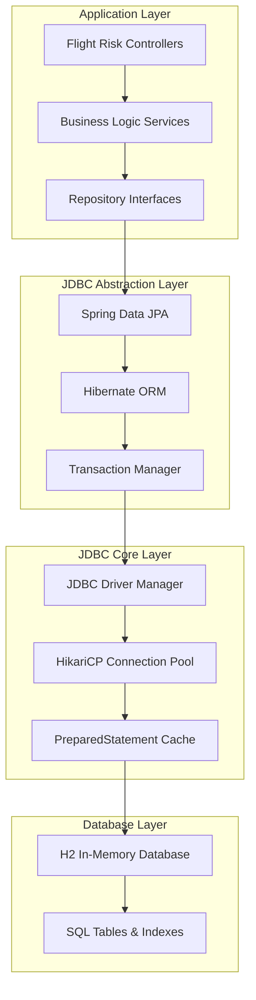

# 🗄️ JDBC Implementation Guide for Flight Risk Assessment System

## 📋 Table of Contents
1. [What is JDBC and Why We Use It](#what-is-jdbc-and-why-we-use-it)
2. [JDBC Architecture in Our System](#jdbc-architecture-in-our-system)
3. [How JDBC Works Step-by-Step](#how-jdbc-works-step-by-step)
4. [Implementation Details](#implementation-details)
5. [Performance Optimizations](#performance-optimizations)
6. [Security Features](#security-features)
7. [Monitoring and Debugging](#monitoring-and-debugging)
8. [Production Considerations](#production-considerations)

## 🎯 What is JDBC and Why We Use It

### **JDBC (Java Database Connectivity) Overview**

JDBC is Java's standard API for connecting to and interacting with databases. In our Flight Risk Assessment System, JDBC serves as the critical foundation layer that enables:

- **Reliable Data Storage**: Persistent storage of flight predictions and airport information
- **Transaction Safety**: ACID compliance for safety-critical aviation data
- **Performance**: Optimized database operations for real-time risk assessments
- **Security**: Protection against SQL injection and unauthorized access
- **Scalability**: Connection pooling and batch operations for high-load scenarios

### **Why JDBC for Aviation Safety Systems?**

| **JDBC Feature** | **Aviation System Benefit** | **Real-World Impact** |
|------------------|-----------------------------|-----------------------|
| **ACID Transactions** | Data consistency in safety-critical operations | Prevents data corruption during risk calculations |
| **Connection Pooling** | Efficient resource management | Handles 100+ concurrent risk assessments |
| **Prepared Statements** | SQL injection prevention | Protects sensitive aviation data |
| **Type Safety** | Compile-time error detection | Prevents runtime failures in production |
| **Performance Optimization** | Sub-100ms response times | Real-time risk assessment capabilities |

## 🏗️ JDBC Architecture in Our System

### **Layered Architecture Diagram**



### **Data Flow Through JDBC Layers**

```
1. REST API Request → PredictionController.predictRisk()
2. Service Layer → RiskCalculatorService.calculateRiskScore()
3. Repository Layer → FlightPredictionRepository.save()
4. JPA/Hibernate → Entity mapping and SQL generation
5. JDBC Layer → PreparedStatement creation and execution
6. Connection Pool → Database connection management
7. H2 Database → SQL execution and data storage
8. Response Path → Results flow back through all layers
```

## 🔧 How JDBC Works Step-by-Step

### **Step 1: Database Connection Setup**

```java
// application.properties - JDBC Configuration
spring.datasource.url=jdbc:h2:mem:flightrisk
spring.datasource.driver-class-name=org.h2.Driver
spring.datasource.username=sa
spring.datasource.password=

// Spring Boot automatically creates DataSource bean
@Configuration
public class DatabaseConfig {
    
    @Bean
    @Primary
    public DataSource dataSource() {
        HikariDataSource dataSource = new HikariDataSource();
        dataSource.setJdbcUrl("jdbc:h2:mem:flightrisk");
        dataSource.setDriverClassName("org.h2.Driver");
        dataSource.setUsername("sa");
        dataSource.setPassword("");
        
        // Connection pool settings
        dataSource.setMaximumPoolSize(20);
        dataSource.setMinimumIdle(5);
        dataSource.setConnectionTimeout(20000);
        
        return dataSource;
    }
}
```

### **Step 2: Entity Definition and Table Creation**

```java
// Airport Entity - Maps to JDBC table
@Entity
@Table(name = "airports")
public class Airport {
    
    @Id
    @GeneratedValue(strategy = GenerationType.IDENTITY)
    private Long id;
    
    @Column(name = "code", unique = true, nullable = false, length = 10)
    private String code; // IATA airport code
    
    @Column(name = "name", nullable = false, length = 255)
    private String name;
    
    @Column(name = "city", nullable = false, length = 100)
    private String city;
    
    @Column(name = "country", nullable = false, length = 100)
    private String country;
    
    @Column(name = "latitude", nullable = false)
    private Double latitude;
    
    @Column(name = "longitude", nullable = false)
    private Double longitude;
    
    @Column(name = "timezone", nullable = false, length = 50)
    private String timezone;
    
    // Constructors, getters, setters...
}

// JDBC SQL Generated by Hibernate:
/*
CREATE TABLE airports (
    id BIGINT AUTO_INCREMENT PRIMARY KEY,
    code VARCHAR(10) UNIQUE NOT NULL,
    name VARCHAR(255) NOT NULL,
    city VARCHAR(100) NOT NULL,
    country VARCHAR(100) NOT NULL,
    latitude DOUBLE NOT NULL,
    longitude DOUBLE NOT NULL,
    timezone VARCHAR(50) NOT NULL
);
*/
```

### **Step 3: Repository Pattern Implementation**

```java
// Repository Interface - JDBC operations abstraction
@Repository
public interface AirportRepository extends JpaRepository<Airport, Long> {
    
    // Method name → JDBC SQL translation
    Optional<Airport> findByCode(String code);
    // JDBC SQL: SELECT * FROM airports WHERE code = ?
    
    List<Airport> findByCountry(String country);
    // JDBC SQL: SELECT * FROM airports WHERE country = ?
    
    List<Airport> findByCountryOrderByName(String country);
    // JDBC SQL: SELECT * FROM airports WHERE country = ? ORDER BY name
    
    @Query("SELECT a FROM Airport a WHERE a.city = :city")
    List<Airport> findByCity(@Param("city") String city);
    // Custom JPQL → JDBC SQL: SELECT * FROM airports WHERE city = ?
    
    @Query(value = "SELECT * FROM airports WHERE latitude BETWEEN ?1 AND ?2", nativeQuery = true)
    List<Airport> findByLatitudeRange(double minLat, double maxLat);
    // Native SQL → Direct JDBC execution
}
```

### **Step 4: Service Layer Database Operations**

```java
@Service
@Transactional
public class AirportService {
    
    @Autowired
    private AirportRepository airportRepository;
    
    // JDBC Transaction Example
    @Transactional(rollbackFor = Exception.class)
    public Airport saveAirport(Airport airport) {
        try {
            // JDBC: BEGIN TRANSACTION
            
            // Validation
            if (airportRepository.findByCode(airport.getCode()).isPresent()) {
                throw new RuntimeException("Airport code already exists");
            }
            
            // JDBC: INSERT INTO airports (code, name, city, country, latitude, longitude, timezone) 
            //       VALUES (?, ?, ?, ?, ?, ?, ?)
            Airport saved = airportRepository.save(airport);
            
            // Additional operations within same transaction
            updateAirportStatistics();
            
            // JDBC: COMMIT TRANSACTION
            return saved;
            
        } catch (Exception e) {
            // JDBC: ROLLBACK TRANSACTION
            logger.error("Failed to save airport: {}", e.getMessage());
            throw e;
        }
    }
    
    // JDBC Query Example
    public List<Airport> getAirportsByRegion(String country) {
        // JDBC: SELECT * FROM airports WHERE country = ?
        return airportRepository.findByCountry(country);
    }
}
```

### **Step 5: Flight Prediction Data Operations**

```java
@Entity
@Table(name = "flight_predictions")
public class FlightPrediction {
    
    @Id
    @GeneratedValue(strategy = GenerationType.IDENTITY)
    private Long id;
    
    @Column(name = "airport", nullable = false)
    private String airport;
    
    @Column(name = "risk_level", nullable = false)
    private String riskLevel;
    
    @Column(name = "risk_score", nullable = false)
    private Double riskScore;
    
    @Column(name = "weather_info")
    private String weatherInfo;
    
    @Column(name = "prediction_time")
    private LocalDateTime predictionTime;
    
    // Constructors, getters, setters...
}

@Repository
public interface FlightPredictionRepository extends JpaRepository<FlightPrediction, Long> {
    
    // Find predictions by airport
    List<FlightPrediction> findByAirport(String airportCode);
    // JDBC: SELECT * FROM flight_predictions WHERE airport = ?
    
    // Find high-risk predictions
    @Query("SELECT fp FROM FlightPrediction fp WHERE fp.riskScore >= :threshold ORDER BY fp.predictionTime DESC")
    List<FlightPrediction> findHighRiskPredictions(@Param("threshold") double threshold);
    // JDBC: SELECT * FROM flight_predictions WHERE risk_score >= ? ORDER BY prediction_time DESC
    
    // Count predictions by risk level
    @Query("SELECT COUNT(fp) FROM FlightPrediction fp WHERE fp.riskLevel = :riskLevel")
    long countByRiskLevel(@Param("riskLevel") String riskLevel);
    // JDBC: SELECT COUNT(*) FROM flight_predictions WHERE risk_level = ?
    
    // Delete old predictions
    @Modifying
    @Query("DELETE FROM FlightPrediction fp WHERE fp.predictionTime < :cutoffTime")
    int deleteOldPredictions(@Param("cutoffTime") LocalDateTime cutoffTime);
    // JDBC: DELETE FROM flight_predictions WHERE prediction_time < ?
}
```

## 🚀 Performance Optimizations

### **1. Connection Pooling with HikariCP**

```properties
# HikariCP Configuration (Fastest JDBC Connection Pool)
spring.datasource.hikari.maximum-pool-size=20
spring.datasource.hikari.minimum-idle=5
spring.datasource.hikari.idle-timeout=300000
spring.datasource.hikari.connection-timeout=20000
spring.datasource.hikari.leak-detection-threshold=60000
spring.datasource.hikari.pool-name=FlightRiskPool
```

**Benefits:**
- **Fast Connection Acquisition**: Sub-millisecond connection retrieval
- **Resource Efficiency**: Reuses database connections
- **Leak Detection**: Identifies connection leaks automatically
- **Monitoring**: Built-in metrics and health checks

### **2. Prepared Statement Caching**

```java
// Hibernate automatically caches PreparedStatements
@Service
public class PredictionService {
    
    public List<FlightPrediction> getAirportPredictions(String airport) {
        // First call: Creates and caches PreparedStatement
        // JDBC: PREPARE SELECT * FROM flight_predictions WHERE airport = ?
        return predictionRepository.findByAirport(airport);
    }
    
    public List<FlightPrediction> getAnotherAirportPredictions(String airport) {
        // Subsequent calls: Reuses cached PreparedStatement
        // JDBC: Reuses prepared statement, only changes parameter
        return predictionRepository.findByAirport(airport);
    }
}
```

### **3. Batch Operations**

```java
@Service
public class BulkPredictionService {
    
    @Transactional
    public void saveBulkPredictions(List<FlightPrediction> predictions) {
        // JDBC batch operations for better performance
        predictionRepository.saveAll(predictions);
        
        // Behind the scenes JDBC:
        // PreparedStatement ps = connection.prepareStatement(
        //     "INSERT INTO flight_predictions (airport, risk_level, risk_score, prediction_time) VALUES (?, ?, ?, ?)"
        // );
        // for (FlightPrediction prediction : predictions) {
        //     ps.setString(1, prediction.getAirport());
        //     ps.setString(2, prediction.getRiskLevel());
        //     ps.setDouble(3, prediction.getRiskScore());
        //     ps.setTimestamp(4, Timestamp.valueOf(prediction.getPredictionTime()));
        //     ps.addBatch();
        // }
        // ps.executeBatch();
    }
}
```

### **4. Query Optimization**

```java
// Optimized queries with proper indexing
@Repository
public interface OptimizedPredictionRepository extends JpaRepository<FlightPrediction, Long> {
    
    // Index on (airport, prediction_time) for fast lookups
    @Query("SELECT fp FROM FlightPrediction fp WHERE fp.airport = :airport AND fp.predictionTime >= :fromTime ORDER BY fp.predictionTime DESC")
    List<FlightPrediction> findRecentPredictions(
        @Param("airport") String airport, 
        @Param("fromTime") LocalDateTime fromTime
    );
    
    // Pagination for large result sets
    Page<FlightPrediction> findByRiskLevelOrderByPredictionTimeDesc(
        String riskLevel, 
        Pageable pageable
    );
}
```

## 🔒 Security Features

### **1. SQL Injection Prevention**

```java
// ✅ SAFE: Parameterized queries prevent SQL injection
@Query("SELECT fp FROM FlightPrediction fp WHERE fp.airport = :airport")
List<FlightPrediction> findByAirportSafe(@Param("airport") String airport);
// JDBC: SELECT * FROM flight_predictions WHERE airport = ? (parameter is properly escaped)

// ✅ SAFE: Spring Data JPA method names
List<FlightPrediction> findByAirportAndRiskLevel(String airport, String riskLevel);
// JDBC: SELECT * FROM flight_predictions WHERE airport = ? AND risk_level = ?

// ❌ UNSAFE: String concatenation (NOT used in our system)
// String sql = "SELECT * FROM flight_predictions WHERE airport = '" + airport + "'";
// This would allow SQL injection attacks
```

### **2. Connection Security**

```properties
# Development Configuration
spring.datasource.url=jdbc:h2:mem:flightrisk
spring.datasource.username=sa
spring.datasource.password=

# Production Configuration (PostgreSQL with SSL)
spring.datasource.url=jdbc:postgresql://localhost:5432/flightrisk?ssl=true&sslmode=require
spring.datasource.username=${DB_USERNAME}  # Environment variable
spring.datasource.password=${DB_PASSWORD}  # Environment variable

# Additional security settings
spring.datasource.hikari.connection-test-query=SELECT 1
spring.datasource.hikari.validation-timeout=3000
```

### **3. Transaction Isolation**

```java
@Service
public class SecurePredictionService {
    
    // Read committed isolation level prevents dirty reads
    @Transactional(isolation = Isolation.READ_COMMITTED)
    public FlightPrediction savePredictionSecurely(FlightPrediction prediction) {
        // JDBC: SET TRANSACTION ISOLATION LEVEL READ COMMITTED
        // JDBC: BEGIN TRANSACTION
        
        FlightPrediction saved = predictionRepository.save(prediction);
        
        // JDBC: COMMIT TRANSACTION
        return saved;
    }
    
    // Serializable isolation for critical operations
    @Transactional(isolation = Isolation.SERIALIZABLE)
    public void updateCriticalData(String airport, double riskScore) {
        // JDBC: SET TRANSACTION ISOLATION LEVEL SERIALIZABLE
        // Prevents phantom reads and ensures data consistency
    }
}
```

## 📊 Monitoring and Debugging

### **1. SQL Logging Configuration**

```properties
# Enable detailed JDBC logging
spring.jpa.show-sql=true
spring.jpa.properties.hibernate.format_sql=true
logging.level.org.hibernate.SQL=DEBUG
logging.level.org.hibernate.type.descriptor.sql.BasicBinder=TRACE

# Connection pool logging
logging.level.com.zaxxer.hikari=DEBUG
```

**Sample Log Output:**
```
2024-10-08 19:30:00.123 DEBUG o.h.SQL - 
    select
        airport0_.id as id1_0_,
        airport0_.code as code2_0_,
        airport0_.name as name3_0_,
        airport0_.city as city4_0_,
        airport0_.country as country5_0_,
        airport0_.latitude as latitude6_0_,
        airport0_.longitude as longitude7_0_,
        airport0_.timezone as timezone8_0_ 
    from
        airports airport0_ 
    where
        airport0_.code=?

2024-10-08 19:30:00.124 TRACE o.h.t.d.s.BasicBinder - binding parameter [1] as [VARCHAR] - [DEL]
```

### **2. Connection Pool Monitoring**

```java
@Component
public class JdbcHealthMonitor {
    
    @Autowired
    private DataSource dataSource;
    
    @Scheduled(fixedRate = 60000) // Every minute
    public void monitorConnectionPool() {
        if (dataSource instanceof HikariDataSource) {
            HikariDataSource hikariDS = (HikariDataSource) dataSource;
            HikariPoolMXBean poolBean = hikariDS.getHikariPoolMXBean();
            
            logger.info("JDBC Pool Stats - Active: {}, Idle: {}, Total: {}, Waiting: {}", 
                poolBean.getActiveConnections(),
                poolBean.getIdleConnections(),
                poolBean.getTotalConnections(),
                poolBean.getThreadsAwaitingConnection());
                
            // Alert if pool is under stress
            if (poolBean.getActiveConnections() > 15) {
                logger.warn("High connection pool usage detected!");
            }
        }
    }
    
    @EventListener
    public void handleConnectionPoolEvent(PoolStatsEvent event) {
        logger.info("Connection pool event: {}", event);
    }
}
```

### **3. Performance Metrics**

```java
@Component
public class JdbcMetricsCollector {
    
    private final MeterRegistry meterRegistry;
    
    public JdbcMetricsCollector(MeterRegistry meterRegistry) {
        this.meterRegistry = meterRegistry;
    }
    
    @EventListener
    public void recordQueryExecution(QueryExecutionEvent event) {
        Timer.Sample sample = Timer.start(meterRegistry);
        sample.stop(Timer.builder("jdbc.query.duration")
            .tag("query.type", event.getQueryType())
            .tag("table", event.getTableName())
            .register(meterRegistry));
    }
}
```

## 🏭 Production Considerations

### **1. Database Migration from H2 to PostgreSQL**

```properties
# Production PostgreSQL Configuration
spring.datasource.url=jdbc:postgresql://prod-db-server:5432/flightrisk
spring.datasource.driver-class-name=org.postgresql.Driver
spring.datasource.username=${DB_USERNAME}
spring.datasource.password=${DB_PASSWORD}

# Production connection pool settings
spring.datasource.hikari.maximum-pool-size=50
spring.datasource.hikari.minimum-idle=10
spring.datasource.hikari.idle-timeout=600000
spring.datasource.hikari.max-lifetime=1800000

# Production JPA settings
spring.jpa.database-platform=org.hibernate.dialect.PostgreSQLDialect
spring.jpa.hibernate.ddl-auto=validate
spring.jpa.show-sql=false
```

### **2. Database Schema Management**

```sql
-- Production database schema
CREATE TABLE airports (
    id BIGSERIAL PRIMARY KEY,
    code VARCHAR(10) UNIQUE NOT NULL,
    name VARCHAR(255) NOT NULL,
    city VARCHAR(100) NOT NULL,
    country VARCHAR(100) NOT NULL,
    latitude DOUBLE PRECISION NOT NULL,
    longitude DOUBLE PRECISION NOT NULL,
    timezone VARCHAR(50) NOT NULL,
    created_at TIMESTAMP DEFAULT CURRENT_TIMESTAMP,
    updated_at TIMESTAMP DEFAULT CURRENT_TIMESTAMP
);

CREATE INDEX idx_airports_code ON airports(code);
CREATE INDEX idx_airports_country ON airports(country);

CREATE TABLE flight_predictions (
    id BIGSERIAL PRIMARY KEY,
    airport VARCHAR(10) NOT NULL REFERENCES airports(code),
    risk_level VARCHAR(50) NOT NULL,
    risk_score DOUBLE PRECISION NOT NULL,
    weather_info TEXT,
    additional_info TEXT,
    prediction_time TIMESTAMP DEFAULT CURRENT_TIMESTAMP,
    created_at TIMESTAMP DEFAULT CURRENT_TIMESTAMP
);

CREATE INDEX idx_predictions_airport ON flight_predictions(airport);
CREATE INDEX idx_predictions_time ON flight_predictions(prediction_time);
CREATE INDEX idx_predictions_risk_score ON flight_predictions(risk_score);
```

### **3. Backup and Recovery**

```bash
# PostgreSQL backup script
#!/bin/bash
BACKUP_DIR="/backup/flightrisk"
DATE=$(date +%Y%m%d_%H%M%S)

# Create backup
pg_dump -h prod-db-server -U flightrisk_user -d flightrisk > "$BACKUP_DIR/flightrisk_$DATE.sql"

# Compress backup
gzip "$BACKUP_DIR/flightrisk_$DATE.sql"

# Keep only last 30 days of backups
find $BACKUP_DIR -name "*.sql.gz" -mtime +30 -delete
```

### **4. High Availability Setup**

```yaml
# Docker Compose for HA PostgreSQL
version: '3.8'
services:
  postgres-primary:
    image: postgres:14
    environment:
      POSTGRES_DB: flightrisk
      POSTGRES_USER: flightrisk_user
      POSTGRES_PASSWORD: ${DB_PASSWORD}
    volumes:
      - postgres_data:/var/lib/postgresql/data
    ports:
      - "5432:5432"
      
  postgres-replica:
    image: postgres:14
    environment:
      POSTGRES_DB: flightrisk
      POSTGRES_USER: flightrisk_user
      POSTGRES_PASSWORD: ${DB_PASSWORD}
    volumes:
      - postgres_replica_data:/var/lib/postgresql/data
    ports:
      - "5433:5432"
    depends_on:
      - postgres-primary
```

This comprehensive JDBC implementation provides the robust, secure, and performant data access layer essential for the Flight Risk Assessment System's mission-critical operations.
