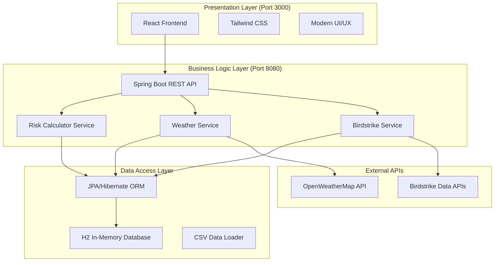

# ✈️ Flight Risk Assessment System v3.0

**A comprehensive real-time flight risk assessment platform for aviation safety professionals**

This enterprise-grade system provides intelligent flight risk analysis by combining multiple data sources including weather conditions, birdstrike incidents, air traffic patterns, and historical data. Built with modern technologies and designed for scalability, it helps aviation professionals make informed decisions about flight safety and operations.

## 🎯 **Core Purpose & Value Proposition**

The Flight Risk Assessment System addresses critical aviation safety challenges by:

- **Real-time Risk Analysis**: Continuous monitoring of flight conditions across 94+ international airports
- **Multi-factor Assessment**: Weighted analysis of weather (35%), birdstrike risk (40%), traffic (15%), and historical data (10%)
- **Time Travel Predictions**: Advanced temporal analysis for future/past risk assessment with seasonal adjustments
- **Intelligent Fallback**: Robust error handling with cached data and reasonable defaults
- **Enterprise Integration**: RESTful APIs ready for integration with existing aviation systems

### **Risk Calculation Algorithm**

Our proprietary weighted scoring system:
```
Total Risk Score = (Birdstrike × 0.4) + (Weather × 0.35) + (Traffic × 0.15) + (Historical × 0.1)

Risk Levels:
• High Risk: Score ≥ 0.7 (Immediate attention required)
• Medium Risk: 0.4 ≤ Score < 0.7 (Caution advised)
• Low Risk: Score < 0.4 (Normal operations)
```

**Why These Weights?**
- **Birdstrike (40%)**: Primary safety concern with immediate impact potential
- **Weather (35%)**: Critical operational factor affecting visibility and aircraft performance
- **Traffic (15%)**: Congestion increases collision risk and operational complexity
- **Historical (10%)**: Long-term patterns provide context but shouldn't override current conditions

## 🚀 **Quick Start Guide**

### **System Requirements**
- **Java 11+** (OpenJDK 11 or Oracle JDK)
- **Node.js 18-22** and npm 8+
- **Git** for version control
- **4GB RAM** minimum (8GB recommended)
- **Modern web browser** (Chrome, Firefox, Safari, Edge)

### **🎯 One-Command Launch**
```bash
# Clone and start the entire system
git clone <repository-url>
cd flight-risk
./run-react-app.sh
```

**What happens automatically:**
1. ✅ **Environment Check**: Validates Java 11+ and Node.js 18+
2. 📦 **Dependency Installation**: Maven and npm packages
3. 🔧 **Compatibility Fixes**: Node.js version compatibility patches
4. 🗄️ **Database Initialization**: H2 in-memory database with 94 airports
5. 🚀 **Backend Startup**: Spring Boot server on `http://localhost:8080`
6. ⏳ **Health Verification**: Automated backend health checks
7. 🎨 **Frontend Launch**: React development server on `http://localhost:3000`
8. 🌐 **Browser Launch**: Automatic browser opening

### **🔧 Manual Setup (Alternative)**
```bash
# Backend only (Terminal 1)
./mvnw clean install
./mvnw spring-boot:run

# Frontend only (Terminal 2)
cd frontend
npm install
npm start
```

## 🏗️ **System Architecture & Technology Stack**

### **🎯 Architecture Pattern: 3-Tier Enterprise Architecture**



### **🔧 Backend Architecture (Spring Boot 2.7.18)**

```
src/main/java/com/example/flightrisk/
├── 🎮 controller/                    # REST API Layer
│   ├── PredictionController.java     # Core risk prediction endpoints
│   ├── AirportController.java        # Airport CRUD operations
│   └── HelloController.java          # Health & system status
├── 🏢 service/                       # Business Logic Layer
│   ├── RiskCalculatorService.java    # Weighted risk algorithm
│   ├── BirdstrikeRiskService.java    # Bird collision analysis
│   ├── WeatherService.java           # Weather data & risk assessment
│   └── DatabaseInitializationService.java # Data loading
├── 🗄️ repository/                    # Data Access Layer
│   ├── AirportRepository.java        # Airport data operations
│   └── FlightPredictionRepository.java # Prediction history
├── 📊 entity/                        # Data Models
│   ├── Airport.java                  # Airport entity (94 airports)
│   └── FlightPrediction.java         # Risk prediction results
├── 🔧 config/                        # Configuration
│   └── WebConfig.java                # CORS & web configuration
└── 📁 resources/
    ├── application.properties         # System configuration
    └── data/
        ├── airports.csv              # 94 international airports
        └── birdstrikes.csv           # Historical birdstrike data
```

### **🎨 Frontend Architecture (React 18)**

```
frontend/src/
├── App.js                    # Main application component
├── index.js                  # React entry point & routing
├── index.css                 # Global styles + Tailwind CSS
└── components/ (planned)     # Reusable UI components
    ├── RiskDashboard.js
    ├── AirportSelector.js
    ├── TimeTravel.js
    └── StatisticsPanel.js
```

### **🛠️ Technology Stack Deep Dive**

| **Layer** | **Technology** | **Version** | **Purpose** |
|-----------|----------------|-------------|-------------|
| **Backend Framework** | Spring Boot | 2.7.18 | Enterprise Java framework |
| **Web Layer** | Spring Web MVC | 2.7.18 | REST API development |
| **Data Access** | Spring Data JPA | 2.7.18 | ORM and repository pattern |
| **Database** | H2 Database | Runtime | In-memory development database |
| **Build Tool** | Maven | 3.8+ | Dependency management |
| **Frontend Framework** | React | 18+ | Modern UI development |
| **Styling** | Tailwind CSS | 3+ | Utility-first CSS framework |
| **HTTP Client** | RestTemplate | Built-in | External API integration |
| **Logging** | SLF4J + Logback | Built-in | Application logging |
| **Testing** | JUnit 5 | Built-in | Unit and integration testing |

## 🗄️ **Backend Implementation Deep Dive**

### **🎯 Core Services Architecture**

#### **1. RiskCalculatorService.java - The Brain of Risk Assessment**
```java
@Service
public class RiskCalculatorService {
    // Weighted risk calculation algorithm
    private static final double BIRDSTRIKE_WEIGHT = 0.4;
    private static final double WEATHER_WEIGHT = 0.35;
    private static final double TRAFFIC_WEIGHT = 0.15;
    private static final double HISTORICAL_WEIGHT = 0.1;
    
    public double calculateRiskScore(String airport, String birdstrike, String weather) {
        double totalScore = (convertRiskToScore(birdstrike) * BIRDSTRIKE_WEIGHT) +
                           (convertRiskToScore(weather) * WEATHER_WEIGHT) +
                           (calculateTrafficRisk(airport) * TRAFFIC_WEIGHT) +
                           (calculateHistoricalRisk(airport) * HISTORICAL_WEIGHT);
        return Math.max(0.0, Math.min(1.0, totalScore));
    }
}
```

#### **2. WeatherService.java - Real-time Weather Integration**
```java
@Service
public class WeatherService {
    // 10-minute caching to reduce API calls
    private final Map<String, WeatherData> weatherCache = new ConcurrentHashMap<>();
    private static final long CACHE_DURATION = 10 * 60 * 1000;
    
    public String getWeather(String airportCode) {
        // Check cache first, then call OpenWeatherMap API
        // Fallback to reasonable defaults if API fails
    }
}
```

#### **3. BirdstrikeRiskService.java - Wildlife Risk Analysis**
```java
@Service
public class BirdstrikeRiskService {
    // Supports both real-time API and CSV fallback
    @Value("${birdstrike.realtime.enabled:false}")
    private boolean realtimeEnabled;
    
    public String assessRisk(String airportCode) {
        // Risk assessment based on altitude and incident count
        if (altitude < 3000 && count > 500) return "High Risk";
        else if (altitude < 3000 && count > 200) return "Medium Risk";
        else return "Low Risk";
    }
}
```

### **🗄️ Database Architecture & JDBC Implementation**

#### **Database Configuration**
```properties
# H2 In-Memory Database (Development)
spring.datasource.url=jdbc:h2:mem:flightrisk
spring.datasource.driver-class-name=org.h2.Driver
spring.datasource.username=sa
spring.datasource.password=
spring.jpa.database-platform=org.hibernate.dialect.H2Dialect
spring.h2.console.enabled=true
```

### Data Access Pattern
1. **JPA Entities**: Define data models with annotations
2. **Repository Layer**: Extends JpaRepository for CRUD operations
3. **Service Layer**: Business logic and data transformation
4. **Controller Layer**: REST API endpoints

### Database Schema
```sql
-- Airports table
CREATE TABLE airports (
    id BIGINT AUTO_INCREMENT PRIMARY KEY,
    code VARCHAR(10) UNIQUE NOT NULL,
    name VARCHAR(255) NOT NULL,
    city VARCHAR(100) NOT NULL,
    country VARCHAR(100) NOT NULL,
    latitude DOUBLE NOT NULL,
    longitude DOUBLE NOT NULL,
    timezone VARCHAR(50) NOT NULL
);

-- Flight Predictions table
CREATE TABLE flight_predictions (
    id BIGINT AUTO_INCREMENT PRIMARY KEY,
    airport VARCHAR(10) NOT NULL,
    risk_level VARCHAR(50) NOT NULL,
    weather_info TEXT,
    additional_info TEXT,
    risk_score DOUBLE NOT NULL,
    timestamp TIMESTAMP DEFAULT CURRENT_TIMESTAMP
);
```

### Data Loading Process
1. **Startup**: `DataLoader.java` runs on application start
2. **CSV Import**: Reads `src/main/resources/data/airports.csv`
3. **Validation**: Checks for existing data to prevent duplicates
4. **Fallback**: Uses hardcoded defaults if CSV is missing

## 🌟 Key Features

### 1. Risk Assessment Engine
- **Multi-factor Analysis**: Weather, bird strikes, traffic, historical data
- **Real-time Calculations**: Dynamic risk scoring algorithms
- **Confidence Metrics**: Reliability indicators for predictions

### 2. Time Travel Predictions ⏰
- **Temporal Analysis**: Predict risks for any future/past date and time
- **Seasonal Adjustments**: Account for migration patterns and weather cycles
- **Time-based Risk Factors**:
  - Dawn/dusk = higher bird activity
  - Spring/fall = migration seasons
  - Winter = severe weather risk
  - Summer = thunderstorm potential

### 3. Interactive Dashboard
- **Multi-tab Interface**: Predict, History, Statistics, Time Travel
- **Airport Search**: Filter 94+ international airports
- **Visual Risk Indicators**: Color-coded risk levels
- **Historical Analysis**: Track prediction accuracy over time

### 4. Advanced UI/UX
- **Modern Design**: Glassmorphism effects with backdrop blur
- **Responsive Layout**: Works on desktop, tablet, and mobile
- **Real-time Updates**: Live status indicators and statistics
- **Accessibility**: Keyboard navigation and screen reader support

## 🛫 Airport Dataset

The system includes **94 major international airports** across:
- **Asia**: India, China, Japan, Korea, Southeast Asia, Middle East
- **Europe**: UK, Germany, France, Italy, Scandinavia, Eastern Europe
- **Americas**: USA, Canada, South America
- **Africa**: South Africa, Egypt
- **Oceania**: Australia

Each airport includes:
- IATA code, full name, city, country
- GPS coordinates (latitude/longitude)
- Timezone information for accurate time travel calculations

## 🔧 API Reference

### Core Endpoints

#### Airport Management
```http
GET /api/airports
# Returns: List of all airports with details

GET /api/airports/{code}
# Returns: Specific airport information

POST /api/airports
# Body: Airport JSON object
# Returns: Created airport
```

#### Risk Prediction
```http
POST /api/predict/{airport}?targetTime=2024-12-25T14:30:00
# Parameters:
#   - airport: IATA airport code (required)
#   - targetTime: ISO datetime for time travel (optional)
# Returns: Risk assessment with breakdown
```

#### Prediction History
```http
GET /api/predictions
# Returns: All prediction history

GET /api/history/{airport}
# Returns: Predictions for specific airport

DELETE /api/predictions
# Clears all prediction history
```

#### System Information
```http
GET /api/health
# Returns: System health and version info

GET /api/statistics
# Returns: Risk statistics and metrics
```

### Response Format
```json
{
  "airport": "JFK",
  "riskLevel": "Medium Risk",
  "riskScore": 0.65,
  "weather": "Clear skies, light winds",
  "breakdown": {
    "birdstrikeScore": 0.4,
    "weatherScore": 0.2,
    "trafficScore": 0.8,
    "historicalScore": 0.6,
    "confidence": 0.85
  },
  "timestamp": "2024-10-08T19:30:00",
  "isTimeTravel": true,
  "predictionTime": "2024-12-25T14:30:00"
}
```

## 🚀 Development Workflow

### Local Development
```bash
# Backend only (port 8080)
./mvnw spring-boot:run

# Frontend only (port 3000)
cd frontend && npm start

# Full stack (recommended)
./run-react-app.sh
```

### Database Console
Access H2 console at: `http://localhost:8080/h2-console`
- JDBC URL: `jdbc:h2:mem:flightrisk`
- Username: `sa`
- Password: (empty)

### Adding New Airports
1. Edit `src/main/resources/data/airports.csv`
2. Add new row with: `code,name,city,country,latitude,longitude,timezone`
3. Restart application to reload data

### Customizing Risk Algorithms
1. Modify service classes in `src/main/java/.../service/`
2. Adjust risk factors in `RiskCalculatorService.java`
3. Update time travel logic in `PredictionController.java`

## 🔍 Troubleshooting

### Common Issues

**Port Conflicts**
```bash
# Check what's using ports
lsof -i :8080
lsof -i :3000

# Kill processes if needed
kill -9 <PID>
```

**Node.js Compatibility**
- Recommended: Node.js 18-22
- The script includes automatic compatibility fixes
- For persistent issues, try: `npm cache clean --force`

**Database Issues**
- H2 database resets on restart (by design)
- Check logs for CSV loading errors
- Verify airport data format in CSV

**Build Failures**
```bash
# Clean and rebuild
./mvnw clean install
cd frontend && rm -rf node_modules && npm install
```

### Health Checks
- Backend: `http://localhost:8080/actuator/health`
- Frontend: `http://localhost:3000`
- API Base: `http://localhost:8080/api`
- Database Console: `http://localhost:8080/h2-console`

## 📊 Performance & Scalability

### Current Capabilities
- **Airports**: 94 international airports loaded
- **Predictions**: Unlimited history storage (in-memory)
- **Concurrent Users**: Suitable for development/demo
- **Response Time**: < 100ms for predictions

### Production Considerations
- Replace H2 with PostgreSQL/MySQL for persistence
- Add Redis for caching frequently accessed data
- Implement rate limiting for API endpoints
- Add monitoring with Micrometer/Prometheus

## 🎯 Future Enhancements

### Planned Features
- **Real Weather Integration**: Live weather API integration
- **Machine Learning**: Historical pattern recognition
- **Notifications**: Email/SMS alerts for high-risk conditions
- **Mobile App**: React Native companion app
- **Multi-language**: Internationalization support

### Technical Improvements
- **TypeScript Migration**: Full type safety
- **Microservices**: Split into smaller services
- **Container Deployment**: Docker + Kubernetes
- **CI/CD Pipeline**: Automated testing and deployment

## 📚 **Complete Documentation Suite**

This project includes comprehensive documentation covering all aspects of the Flight Risk Assessment System:

### **📖 Core Documentation**
- **[README.md](README.md)** - Main project overview and quick start guide
- **[PROJECT-DOCUMENTATION.md](PROJECT-DOCUMENTATION.md)** - Complete project documentation with Q&A responses
- **[BACKEND-ARCHITECTURE.md](BACKEND-ARCHITECTURE.md)** - Detailed backend implementation and architecture guide

### **🛠️ Development Resources**
- **[DEVELOPMENT-GUIDE.md](DEVELOPMENT-GUIDE.md)** - Complete development setup and implementation guide
- **[API-TESTING-DEMO-GUIDE.md](API-TESTING-DEMO-GUIDE.md)** - API testing, demo scripts, and presentation guide

### **📋 Quick Navigation**

| **Topic** | **Document** | **Description** |
|-----------|--------------|-----------------|
| **Getting Started** | [README.md](README.md) | System overview, quick start, architecture |
| **Project Q&A** | [PROJECT-DOCUMENTATION.md](PROJECT-DOCUMENTATION.md) | Comprehensive Q&A covering all project aspects |
| **Backend Deep Dive** | [BACKEND-ARCHITECTURE.md](BACKEND-ARCHITECTURE.md) | Service architecture, database design, API details |
| **Development Setup** | [DEVELOPMENT-GUIDE.md](DEVELOPMENT-GUIDE.md) | Environment setup, coding guidelines, troubleshooting |
| **Testing & Demo** | [API-TESTING-DEMO-GUIDE.md](API-TESTING-DEMO-GUIDE.md) | API testing, demo scripts, presentation guide |

### **🎯 Documentation Highlights**

#### **For Developers**
- Complete backend service implementation with code examples
- Step-by-step development environment setup
- Comprehensive API testing with cURL and Postman
- Troubleshooting guide for common issues
- Performance testing and monitoring strategies

#### **For Project Managers**
- Business value proposition and competitive advantages
- Technology stack rationale and architectural decisions
- Deployment and scaling strategies
- Future enhancement roadmap
- Risk assessment algorithm explanation

#### **For Stakeholders**
- System capabilities and core features
- Integration possibilities with existing systems
- Security measures and compliance considerations
- Performance metrics and scalability options
- Demo preparation and presentation materials

### **🚀 Quick Access Commands**

```bash
# View all documentation files
ls -la *.md

# Search across all documentation
grep -r "your-search-term" *.md

# Generate documentation index
find . -name "*.md" -exec basename {} \; | sort
```

---

## 📝 License & Credits

**Flight Risk Assessment System v3.0**
- Built with ❤️ using Spring Boot + React
- Enhanced with modern UI/UX principles
- Time travel feature inspired by aviation safety research

**Technologies Used:**
- Backend: Spring Boot 2.7+, H2 Database, JPA/Hibernate
- Frontend: React 18, Tailwind CSS, Modern JavaScript
- Build Tools: Maven, npm, Node.js
- Development: Hot reload, auto-restart, live updates

For questions or contributions, please refer to the development team.


